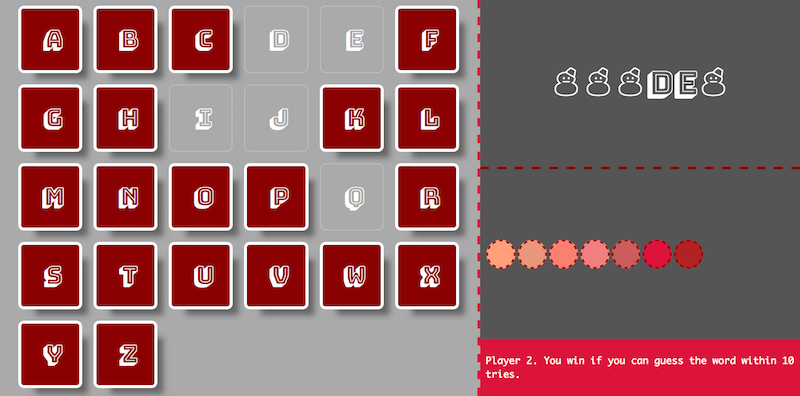

[](https://github.com/chauff/cse1500-balloons-game/actions)

# Demo game for CSE1500



This word guesser game is the demo game for the Web technology part of CSE1500, the first-year *Database and Web Technology* course within TU Delft's computer science curriculum. The lecture materials are available [in a separate GitHub repository](https://github.com/chauff/cse1500-web-transcripts). 

Make sure that you have [Node.js](https://nodejs.org/en/) installed as well as [git](https://git-scm.com/).

To start the game, execute the following steps in the terminal:

```console
git clone https://github.com/chauff/balloons-game.git
cd balloons-game
npm install
npm start
```

You can now access the game at [http://localhost:3000/](http://localhost:3000/) in the browser. Open another browser window to access the game as another player.

If you want to change the port two actions are required: 

1. Alter `balloons-game/package.json` (change the line `node app.js 3000` and replace `3000` with your preferred port).
2. Alter `balloons-game/public/javascripts/config.js` (the port of the Websocket URL).

A click on the "Play" button brings you to the game. If you are Player 1, you are asked to think of an English word to guess. If you are Player 2, you are asked to start guessing the word Player 1 thought of.

**If you attempt to play in a browser tab whose size is below min. `800px` x `800px` you will see a _Your window is too small to play this game._ message.** The design is not optimized for mobile devices.

The demo code base also shows off how to execute **unit tests** with [Jest](https://jestjs.io/), a JavaScript testing library, as well as **end-to-end tests** with [Nightwatch](https://nightwatchjs.org/). If you want to see whether all tests pass, run (after installing it):

```
npm test
```

*Note: you will learn all about testing in a later course; Jest is included here for those that want to know how testing in JavaScript can be done.*

The code is mostly void of [ES6 features](http://es6-features.org/). This was a conscious choice due to the small amount of time we have to teach JavaScript. **You can of course use any ES6 features in your own code.**

In alignment with the first web technology assignment, the wireframe designs for this game are the [splash screen](https://wireframe.cc/uInPWd) and the [game screen](https://wireframe.cc/z9NaMr).

The game required very few public resources. They are listed here:

- The English word list came from https://github.com/dwyl/english-words
- [Button click sound](http://www.pachd.com/button.html)
- [Balloon pop sound](https://bigsoundbank.com/detail-1023-explosion-far-away.html)
